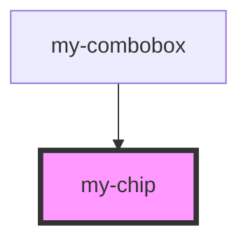

# my-chip

<!-- Auto Generated Below -->

## Properties

| Property      | Attribute   | Description | Type      | Default |
| ------------- | ----------- | ----------- | --------- | ------- |
| `data`        | --          |             | `{}`      | `{}`    |
| `isDeletable` | `deletable` |             | `boolean` | `false` |

## Events

| Event            | Description | Type               |
| ---------------- | ----------- | ------------------ |
| `my-chip-delete` |             | `CustomEvent<any>` |

## Dependencies

### Used by

 - [my-combobox](../combobox)

### Graph

----------------------------------------------

*Built with [StencilJS](https://stenciljs.com/)*
