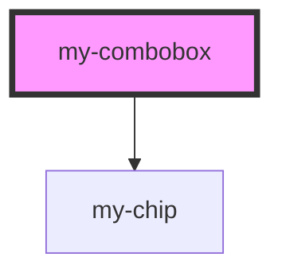

# my-select

<!-- Auto Generated Below -->

## Properties

| Property          | Attribute     | Description | Type      | Default          |
| ----------------- | ------------- | ----------- | --------- | ---------------- |
| `defaultOptions`  | --            |             | `any[]`   | `[]`             |
| `disabled`        | `disabled`    |             | `boolean` | `false`          |
| `multiple`        | `multiple`    |             | `boolean` | `false`          |
| `placeholder`     | `placeholder` |             | `string`  | `'Select value'` |
| `selectedOptions` | --            |             | `any[]`   | `[]`             |

## Events

| Event       | Description | Type               |
| ----------- | ----------- | ------------------ |
| `my-change` |             | `CustomEvent<any>` |

## Dependencies

### Depends on

- [my-chip](../chip)

### Graph

----------------------------------------------

*Built with [StencilJS](https://stenciljs.com/)*
