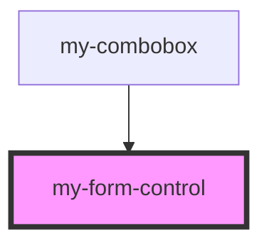

# form-control

<!-- Auto Generated Below -->

## Properties

| Property | Attribute | Description | Type     | Default |
| -------- | --------- | ----------- | -------- | ------- |
| `id`     | `id`      |             | `string` | `null`  |
| `label`  | `label`   |             | `string` | `null`  |

## Events

| Event            | Description | Type               |
| ---------------- | ----------- | ------------------ |
| `my-label-click` |             | `CustomEvent<any>` |

## Dependencies

### Used by

 - [my-combobox](../combobox)

### Graph

----------------------------------------------

*Built with [StencilJS](https://stenciljs.com/)*
