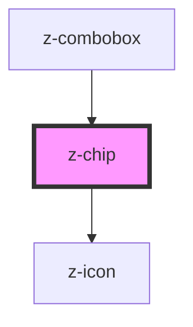

# my-chip

<!-- Auto Generated Below -->

## Properties

| Property        | Attribute     | Description | Type      | Default |
| --------------- | ------------- | ----------- | --------- | ------- |
| `data`          | --            |             | `{}`      | `{}`    |
| `isDismissible` | `dismissible` |             | `boolean` | `false` |

## Events

| Event            | Description | Type               |
| ---------------- | ----------- | ------------------ |
| `z-chip-dismiss` |             | `CustomEvent<any>` |

## Dependencies

### Used by

 - [z-combobox](../z-combobox)

### Depends on

- [z-icon](../z-icon)

### Graph

----------------------------------------------

*Built with [StencilJS](https://stenciljs.com/)*
