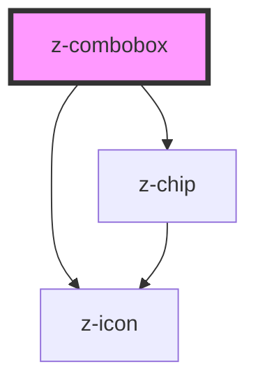

# my-select

<!-- Auto Generated Below -->

## Properties

| Property         | Attribute     | Description | Type      | Default          |
| ---------------- | ------------- | ----------- | --------- | ---------------- |
| `defaultOptions` | --            |             | `any[]`   | `[]`             |
| `isClearable`    | `clearable`   |             | `boolean` | `false`          |
| `isDisabled`     | `disabled`    |             | `boolean` | `false`          |
| `isMultiple`     | `multiple`    |             | `boolean` | `false`          |
| `isOrdered`      | `ordered`     |             | `boolean` | `false`          |
| `isRequired`     | `required`    |             | `boolean` | `false`          |
| `label`          | `label`       |             | `string`  | `null`           |
| `placeholder`    | `placeholder` |             | `string`  | `'Select value'` |

## Events

| Event      | Description | Type               |
| ---------- | ----------- | ------------------ |
| `z-change` |             | `CustomEvent<any>` |

## Dependencies

### Depends on

- [z-chip](../z-chip)
- [z-icon](../z-icon)

### Graph

----------------------------------------------

*Built with [StencilJS](https://stenciljs.com/)*
