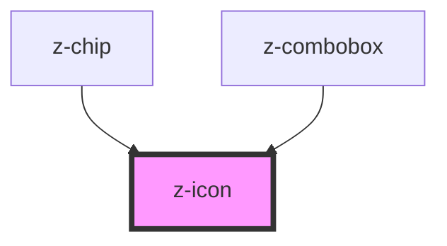

# my-icon

<!-- Auto Generated Below -->

## Properties

| Property    | Attribute    | Description                                                                                 | Type      | Default     |
| ----------- | ------------ | ------------------------------------------------------------------------------------------- | --------- | ----------- |
| `ariaLabel` | `aria-label` | Specifies the label to use for accessibility. Defaults to the icon name.                    | `string`  | `undefined` |
| `color`     | `color`      |                                                                                             | `string`  | `undefined` |
| `lazy`      | `lazy`       | If enabled, icon will be loaded lazily when it's visible in the viewport. Default, `false`. | `boolean` | `false`     |
| `name`      | `name`       | Specifies which icon to use from the built-in set of icons.                                 | `string`  | `undefined` |
| `size`      | `size`       | The size of the icon. Available options are: `"small"` and `"large"`.                       | `string`  | `undefined` |

## Dependencies

### Used by

 - [z-chip](../z-chip)
 - [z-combobox](../z-combobox)

### Graph

----------------------------------------------

*Built with [StencilJS](https://stenciljs.com/)*
